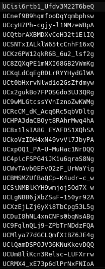

# UTubeTrollKiller

### Say goodbye to the UTTP

Imagine this... You post a fan video of DannoCal, Glitch, SMG4, Game Theory, etc., and then you see a whole load of this being spammed by UTTP crackheads:

> WHO ASKED + UTTP IS BETTER THAN DANNOCAL, GLITCH, SMG4, MURDER DRONES, TADC, AND ALL FANDOMS

Well, you can now kiss goodbye to these duncefucks with UTTK, or UTubeTrollKiller by NXX99. It fetches channel IDs in a console log so you can copy and paste them into youtube studio's blacklist feature!

###### Note: This is a dumbed down version of a script by Switch

## Using the script

### Requirements

* A PC or Mac
* [NodeJS](https://nodejs.org)
* [YoutubeI](https://www.npmjs.com/package/youtubei)

Don't have these? Assuming you have a PC or Mac, here's some steps for various OSes

__Windows Installation__

First, open Powershell and install [scoop](https://scoop.sh/)

Second, in a Powershell or CMD window, run `scoop install nodejs`

__MacOS installation__

First, download and run the package file from [the official NodeJS download page](https://nodejs.org/en/download)

__Linux installation__

On Debian/Debian based distros (Ubuntu and its flavors, Pop!_os, KDE neon, Q4OS, Linux mint, so on and so forth,) run `apt-get install nodejs`. If you're not root, put sudo before the command.

On RHEL-Based distros (Red Hat, Fedora, CentOS, OpenSUSE, etc.,) run `rpm install nodejs`, of course, as sudo if you're not root.

For any other distro (arch, gentoo, or Linux From Scratch,) or other UNIX-Based OSes (Such as BSD distrobutions like FreeBSD and OpenBSD, Solaris,) look up a tutorial on how to install NodeJS.

To verify, run `node .help` to see if you installed NodeJS.

After installing and verifying, run `npm install youtubei`.

### Step 1

Clone this repository and CD into it, and run `node index.js`, and you should be seeing a slew of channel IDs separated by commas and spaces. It's best to let it run for a few minutes before stopping.

### Step 2

Kill the script using the CTRL + C or ALT + Q Keyboard combinations, and open `idlist.txt`. You should see something similar to this:

Copy the file's contents.

### Step 3

Go to your [YouTube Studio](https://studio.youtube.com), go to settings in the bottom right corner, and go to Community. Scroll down until you see a text box like this:

Click that and paste. After pasting, save. Double check by going back. After returning to the list, you should see something like this:

If you see something like that, it was a success. No further action is needed.

## Changelog

|Version|Update Note|
--
|May 7th, 2024|Now saves the collected UTTP member name and ID lists to separate text files instead of needing to copy them directly from the terminal window.|